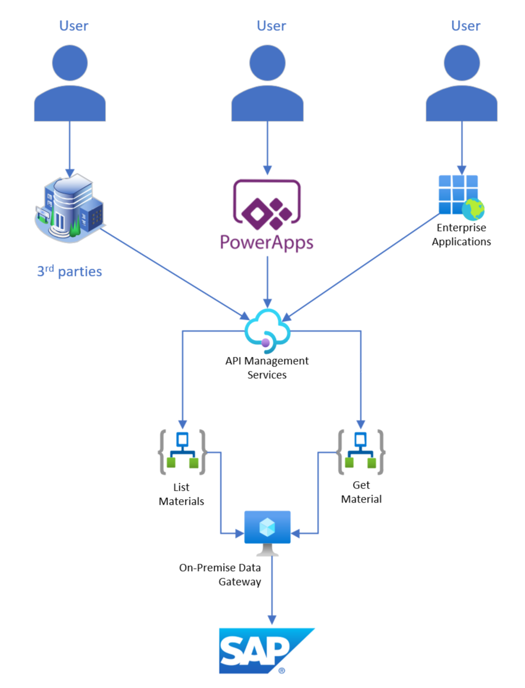

# Fusion Application - Materials

## Overview
This scenario demonstrates a how a fusion app, Power Platform with Azure, can be used to build solutions on top of SAP.  While the Power Platform itself has SAP integration capabilities, the Power Platform is not designed to securly expose APIs to other applications or 3rd parties.

This scenario is intended to show how to leverage both Azure and the Power Platform together in order to maximize flexibility, performance, and reach.

### Azure Components Used
- Logic App Standard
- Azure APIM
- Custom Connector for the Power Platform
- Power Application
- Depends On SAP-Schema-Generation
- Depends On Base Infrastructure Deployment

### Visual Studio Code Extensions Used
- Azure Tools - Microsoft
- Azure Logic Apps (Standard) - Microsoft
- Bicep - Microsoft
- Azure API Management - Microsoft

### HIgh Level Architecture
When the user opens the power app, the application makes a request of the BAPI_Materials_getlist function through the custom connector, to APIM, to a LogicApp, threw the On Premise Data Gateway, and finally to SAP.  This pulls back a list of Materials from SAP and displays the information within the Power App.

When I user clicks a material within the list, a request to the BAPI_Material_Get_Detail to fetch details about the material and display that information within the app.  The request path is almost idential to the GetList path, except it flows through a different API operation and LogicApp.

Note: 3rd party solutions and enterprise applications are not included in this sample.  They are depicted in the architecure to better demonstrate the advantages of a fusion app over Power Automate alone.

Note: sample screen shot of the power application

## Deployment

### Infrastructure

### Application

## Testing

## TODO
- LogicApp Workflows (GetList, GetDetail)
- APIM APIs
- Custom Connector
- Power Application
- Bicep
- Deployment Scripts
- Test Scripts
- Documentation