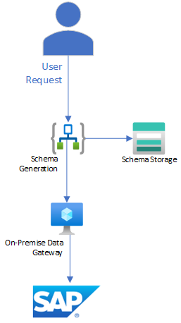

# Schema Generation

## Overview
To send/receive RFC, BAPI, iDoc messages/files to/from sap you need to understand message formats.  You can extract XML Schemas from SAP for the specific functions you wish to integrate with.

The SAP Connector uses the On-Premise Data Gateway to connect.  You will need to create and configure that resource as a pre requisite.

### Azure Components Used
- VM
- On Premise Data Gateway
- Logic App Standard
- Storage Account - LogicApp
- Storage Account - Schemas

### Visual Studio Code Extensions Used
- Azure Tools - Microsoft
- Azure Logic Apps (Standard) - Microsoft
- Bicep - Microsoft
- REST Client - Huachao Mao

### High Level Architecture

The user submits an HTTP request containing an array of SAP Schemas to be generated.  The LogicApp fetches the schemas and writes them to a storage account.  A test file with a sample request can be found in TestFiles\GenerateSchemas.http

### Flow Detail

When a request is received the workflow will loop through the list of schemas to be generated.  For each schema, a call will be made to SAP.

The call to SAP will return an array of schemas.  For each schema the workflow will check to see if it already exists and if it does, remove it, then create the schema within the Blob Container.

## Deployment
The solution uses components deployed as a part of the base deployment.  Please ensure that that environment has been deployed first.

### On Prem Data Gateway
- Create a new windows VM
- Install the SAP Connector PreRequisites
- Install the OnPrem Data Gatway
- Obtain the Gateway InstalationID

## Use

## Understanding and Using Generated Schemas