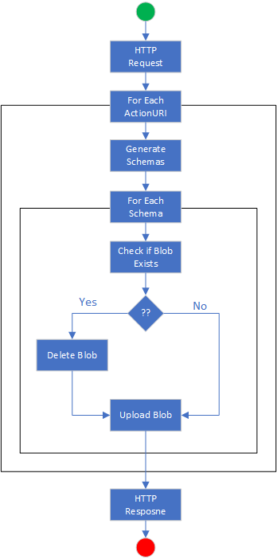
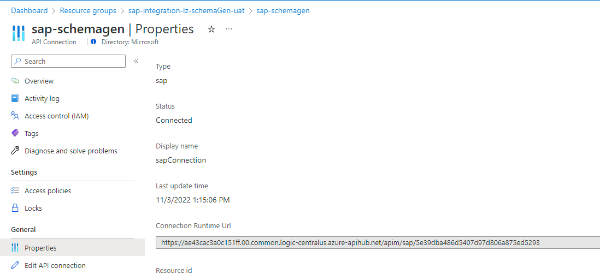

# Schema Generation

## Overview
To send/receive RFC, BAPI, iDoc messages/files to/from sap you need to understand message formats.  You can extract XML Schemas from SAP for the specific functions you wish to integrate with.

The SAP Connector uses the On-Premise Data Gateway to connect.  You will need to create and configure that resource as a pre requisite.

### Azure Components Used
- VM
- On Premise Data Gateway
- Logic App Standard
- Storage Account - LogicApp
- Storage Account - Schemas

### Visual Studio Code Extensions Used
- Azure Tools - Microsoft
- Azure Logic Apps (Standard) - Microsoft
- Bicep - Microsoft
- REST Client - Huachao Mao

### High Level Architecture

The user submits an HTTP request containing an array of SAP Schemas to be generated.  The LogicApp fetches the schemas and writes them to a storage account.  A test file with a sample request can be found in TestFiles\GenerateSchemas.http


### Flow Detail

When a request is received the workflow will loop through the list of schemas to be generated.  For each schema, a call will be made to SAP.

The call to SAP will return an array of schemas.  For each schema the workflow will check to see if it already exists and if it does, remove it, then create the schema within the Blob Container.



## Deployment
The solution uses components deployed as a part of the base deployment.  Please ensure that that environment has been deployed first.

Kick of infrastructure deployment to your default subscription with by running the deployment script .\deploymentscript.ps1.  You can also deploy the infrastructure independent of the app code or if you run into an issue with the script, you can use the following commands to deploy the scenario

```az deployment sub create --location <location> -f bicep\main.bicep ```

Kick off infrastructure deployment to a specified subscription
```az deployment sub create --location <location> --subscription <subscription> -f bicep\main.bicep ```

NOTE: at this point, the application has not been deployed to Azure

### On Prem Data Gateway
Use the bastion host to access the VM which will host your on prem data gateway(opdg) and open a browser and download the file found here; https://www.microsoft.com/en-us/download/details.aspx?id=53127.  Once installed, you will be asked to authenticate against azure to finsh the setup.

To use the SAP connector there are several prerequisits that need to be installed on the opdg computer, and you will need to make sure that the SAP user being used has the correct permissions within SAP.  For details, please see the documentation; https://learn.microsoft.com/en-us/azure/logic-apps/logic-apps-using-sap-connector.  Here is a link to the SAP connector for .NET; https://support.sap.com/en/product/connectors/msnet.html.


You will need to obtain\create the onPrem data gateway's external id.  This will be used to connect the Azure API connection with the OnPrem Data Gateway.  The external id is in the following format

```  /subscriptions/<subscriptionid>/resourceGroups/<resourcegroup where deployed>/providers/Microosft.Web/connectionGateways/<gateway name>  ```

You  can find the external id by running the OnPrem data gateway application, selecting diagnostics and exporting the logs.  Open the GatewayClusters.txt file in notepad.  The external/resourceId will be in the metadata field which is in the same json object as the gatewayId.

Once you have the externalId, you need to go to the Azure API Connection and edit its configuration.  You will see an empty 'Data Gateway' field.  drop the externalId in that field and save your changes.  The connector will validate the information and return an error if there is a problem.  

## Configuring Local Development Environment
There are a couple of settings we need to change in connections.json, local.settings.json, and parameters.json.  These changes will allow you to test and debug your application locally.

### Configure API Connection
You need to obtain the OnPrem Data Gateway ResourceId/ExternalId and copy that into the Data Gateway field of the apiConnection.  If you didn't capture the information when you created the OnPrem Data Gateway, you can obtain it from the OnPremise Data Gateway service's JSON via the Azure Portal.


You will then want to edit the API Connections properties and past the resourceID into the Data Gateway field.


### Configure the RuntimeUrl
in the apiConnection, go to properties and copy the runtimeURL



Copy that value in to the connectionsRuntimeUrl value within the connections.json file

### local.settings.json configuration
We need to make sure the resource group, tenant id, subscription id, and Azure blob connection string found in the local.settings.json file are correct.

You can obtain these values from the the LogicApp Configuration pane.  To make it easier, choose advanced edit.


### Refresing the authorization token
Since the sap connector is a managed connector, it actually runs in Azure as a serverless capability.  Communication between your logicapp and the connector is rest based and authenticates with a JWT token.  When you move your logic app to a new subscription or when it expires you have to refresh it manually.

Couple of things to make this simpler.  Ensure that the Azure Tools extension is logged into the account and has access to the subscription where you are hosting the production version of the logicApp.

Open the Connections.json file and update the connectionId to be somthing other than ....\schemaGen, then open the workflow designer by right clicking on workflow.json.  This should show an error on the schema generation activity.

Click the activity and you should be presented with the connection you provisioned as an option, or it may automatically select it.  At this point, simply save your workflow.  This should trigger a token refresh and wire up your workflow.

NOTE: if this doesn't work, create a new logicapp project, enable azure connectors, and point it to the resource group where the scenario is deployed.  Open the designer, drop an http request trigger and a generate schemas action on the designer.  If you are prompted to create a new connection, do so, save the workflow, close the designer... then reopen the designer, select the apiConnection that was provisioned with the script and save again.  You can now copy the token from temp projects local.settings.json file over to the schemaGeneration project's local.settings.json file.

## Test Locally
Once you have configured your local dev environment, run it locally and use the test-GenerateSchemas.http file to test everything end to end.

You will need to run teh azure storage emulator locally on your machine.  THis is required by the LogicApp.  Alternatively, you can point  your locally running LogicApp to an Azure Storage Account.

In visual studio code, debug the application to start a local instance

You will need to update the URI used by the test file to point to your locally running instance of the workflow and have the appropriate keys.  Right click on the workflow.json file in the GenerateSchemas folder and select 'Overview'.  NOTE: your workflow must be running for Overview to work.  This will show you the URI to the locally running instance.  Copy the URI and overwrite the one in the test file.  If you have the REST client extension by Huachao Mao installed, you should see a send link appear above the URL.  You can also use that URL and payload in another other tool, such as Postman.

After invoking the logicApp, if everything is configured correctly, you should have three folders in your storage account container and two schemas in each folder.  NOTE: that these must exist on SAP and the credentials used to access SAP must be able to access them.

## Deploying to Azure
The easiest way to deploy your logicapp to azure is to use the LogicApp Standard extension.  Simply expand your subscription\logicapp and right click deploy.


## Testing Your Azure Deployment
With your application deployed, go to the logicapp workflow overview to pickup the URL for the workflow.  Copy the URL and paste it into the test-GenerateSchemas.http file as the AzureURL.


After you have clicked send, in a few seconds a Restponse(12345ms) tab will open showing you the response from the logicapp.  If everything ran successfully, you should see a 200ok and a collection of ids which can be used to correlate back to the completed workflow.

Going back to the Azure Portal.  Viewing the Overview page for the workflow, you should see a new line item in the run history table showing success.


Clicking on the runId will show you the details of the run and allow you to inspect each activity.

Lastly, you will want to check the storage account to ensure that your schemas were created.  They will be located in the schemas container and should appear as follows.


## Understanding and Using Generated Schemas
The generated schemas will typically have two files per RFC/BAPI/iDOC.  rfc.xsd and types.xsd.  rfc.xsd represents the interface you are calling and the types.xsd file represents the tables used by the interface.

Unless you have an XML tool that can generate sample xml from linked xsd files, you are going to have to do some manual work.

Manually create an xml file based on the rfc.xsd.  Anywhere you see a node referencing a type, note the type, we will be able to generate them and then copy the values to build out the sample document.

use https://www.liquid-technologies.com/online-xsd-to-xml-converter do build out sample XML from the types.rfc file.

## TODO
- Automate OPDG install and configure
- Automate SAP Prereq install
- Capture outputs from infra deploy and pass to app deploy
- Configure Monitoring
- powershell to deploy application
- finish doc showing how to leverage schemas